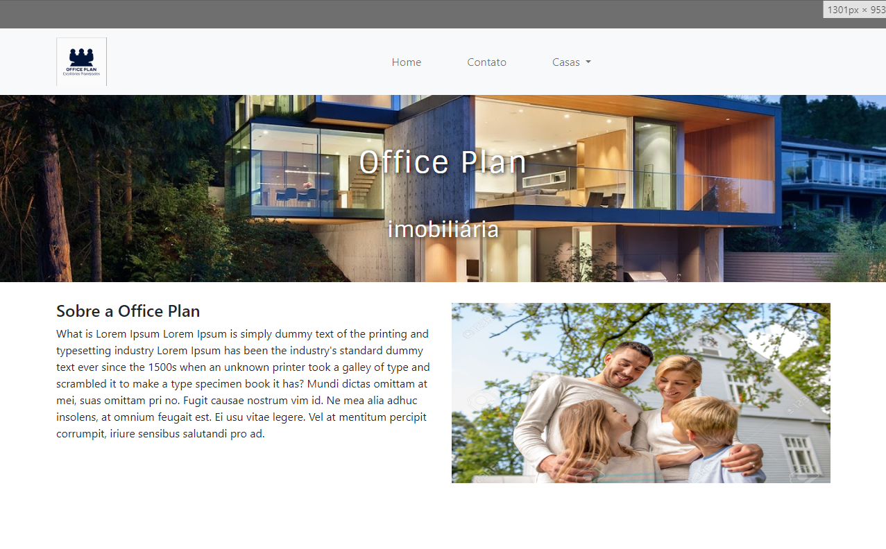

# Office Plan

## Sobre

O projeto é um site de uma imobiliária fictícia e foi um dos meus primeiros projetos.
Elaborado junto a um protótipo figma com foco em responsividade e na utilização do framework bootstrap.

Acesso ao [Protótipo figma](https://www.figma.com/file/rqQqSqRs97OD59gwT2aKE5/Office-Plan?type=design&node-id=0%3A1&mode=design&t=DPx0FgSeT74RTpsM-1).
 
Vizualizar projeto [Office Plan](https://thiag-o.github.io/website-plan/).

## 🚀 Instalação

Para iniciar o projeto:

Abrir o arquivo `index.html` em algum navegador ou utilizar o [Live Server](https://marketplace.visualstudio.com/items?itemName=ritwickdey.LiveServer) no vscode.

## Tecnologias

